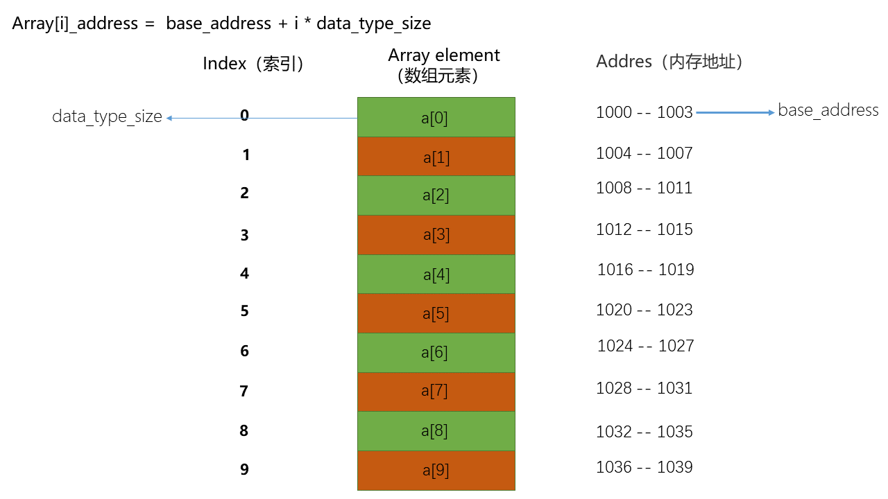
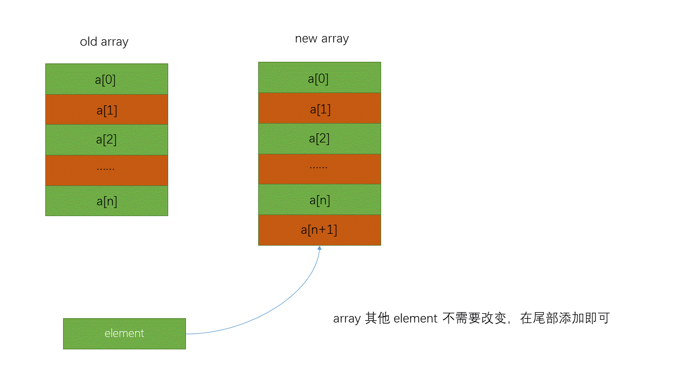
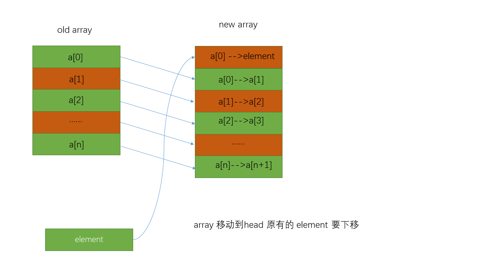
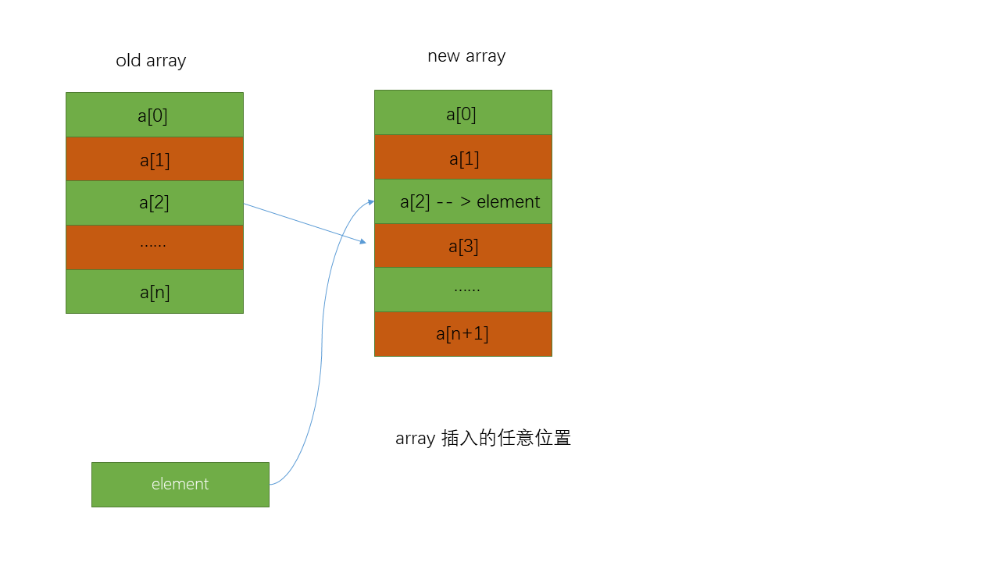

#data_structure #array

## What Array

数组（英语：Array），是由**相同类型的元素**（element）的集合所组成的 [[Linear List]] **线性表**数据结构，分配一块**连续的内存**来存储。利用元素的**索引**（index）可以计算出该元素对应的存储地址。

## Why Array

### strong point

两个最重要特性**连续内存**和**相同类型元素**赋予了 Array 一个最大的优势**随机访问**

计算机中每个内存单元都会分配一个地址，当我们定义一个 Array 大小时候，会向系统申请一个整体内存，这个内存用来存放 Array，计算机也会知道这个数组的第一个 element 地址（也叫基础地址，base_address），也就是 array[0]， 因为是连续的相同元素，所以每个元素占用的大小是一样的，比如 int 占 4 byte（data_type_size），那么就可以轻松计算出每个元素的地址，公式：`Array[i]_address = base_address + i * data_type_size`

其实就是根据这个公式，根据下标的访问时间复杂度是 O(1)。

> 数组支持随机访问，根据下标随机访问的时间复杂度为 O(1)，而不是查找元素的复杂度是 O(1)，元素查找的复杂度是 O(n)，使用好的算法最好的复杂度也是 O(logn)；

### weak point

这种连续内存的缺点就是**插入**（insert）和删除（delete）比较慢；

#### insert
1. insert tail（尾部插入）

	尾部插入，array 其他部分不需要改变，直接插在尾部即可，时间复杂度是 O(1)

2. insert head（头部插入）

	头部插入，array 其他所有的部分都需要往后移一位，时间复杂度是 O(n)

3. insert random（随机插入）

	随机插入，插入 array 位置之后的所有元素都需要后移，按照概率来算，随机插入某个位置的时间复杂度是：(1+2+3...+n)/n = O(n)；

4. 总结：数组尾部插入时间复杂度是 O(1)，其他都是 O(n);

#### delete
删除同插入是一样的原理，
1. 尾部删除 O(1);
2. 头部删除 O(n);
3. 随机删除 O(n)

#### special insert/delete

1. special insert
 	不要求 array 有序情况下，将 element k 插入到指定位置，如果对 array 顺序没有要求，可以将 k 插入到指定位置，同时将替代的原来 element 移到尾部，这样也能实现 O(1) 时间复杂度；
 2. special delete
	 不追求 array 的连续性情况下，删除指定元素，可以将删除的元素标记，在内存不足的时候，再将标记的删除元素一起删除，这样子就保证了一次删除，时间复杂度会有明显提升；
	 
 	这不就是 JVM 标记清除垃圾回收算法的核心思想！
	
 ## array 越界
 
 
 
 ## container VS array（容器是否能替代数组）
 
 container 会对 array 进行封装，
 - 提供了便利，更好的 api 操作，动态扩容等等；
 - 封装时候，性能会有一些损失，但是绝大多数情况下没有什么影响，除非最底层对性能有极致要求的，会使用 array；
 - 多维数组，使用 array 会更加直观，container 

---

## Python 中的数组

Python3 中[[Python3 list 实现]]

在 Python 中，使用 list 来表示数组，list 对象[实现为一个动态数组](https://docs.python.org/zh-cn/3.9/faq/design.html#id21)，也就是长度根据需要自动调整的数组，这个数组**支持不同类型元素存储**，其实是 Array 存储的指针。

Python3 中[[]]
另外[array 模块-Efficient arrays of numeric values(高效的数值数组)](https://docs.python.org/zh-cn/3.9/library/array.html))也提供了接近C语言数组的只支持同类型元素的数组。

