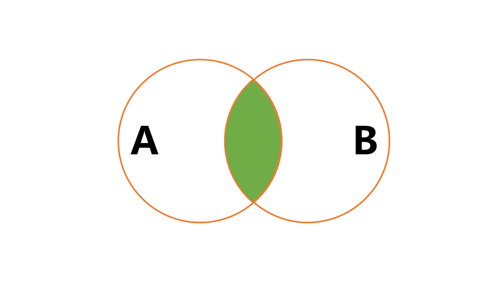
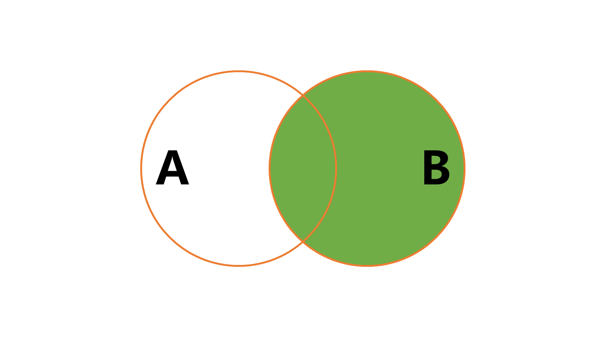
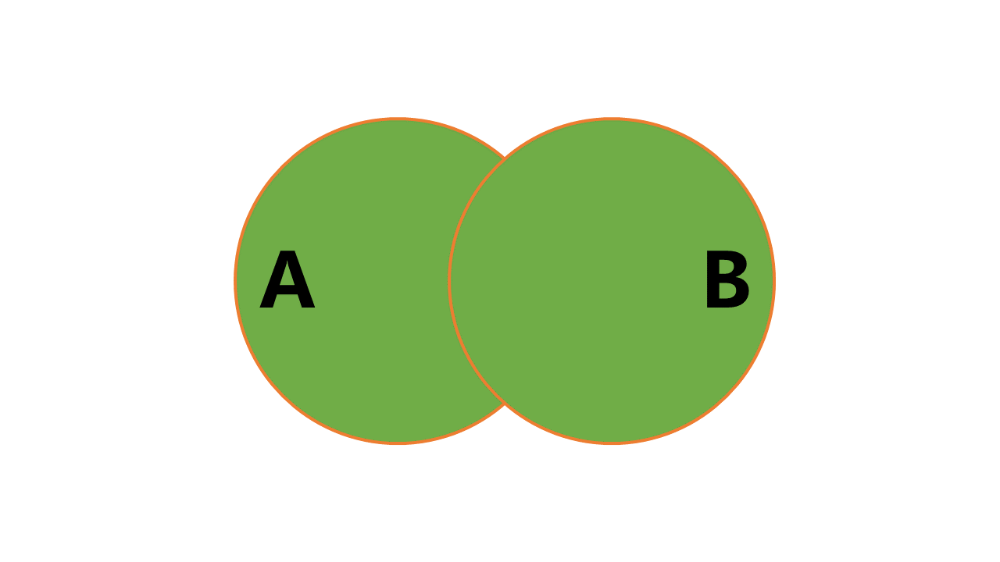

# Join

## SQL 标准

> SQL：Structured Query Language:结构化查询语言，[SQL 维基百科](https://zh.wikipedia.org/wiki/SQL)

SQL在1986年被ANSI标准化，1987年被ISO标准化。1992 年的 SQL-92 标准，成为现代SQL的基础。此后陆续都会有新的 SQL 标准出来，其中 SQL-99 也是一个很重要的标准：增加了正则表达式匹配、递归查询（传递闭包）、数据库触发器、过程式与控制流语句、非标量类型(arrays)、面向对象特性。SQL 标准会随着时代的发展添加新的标准，但是最本质的基础还是不会修改的(SQL-92 和 SQL-99 算是最基础的)，比如 SQL2016 增加行模式匹配、多态表函数、JSON，添加 JSON 也是跟随时代，毕竟现在大多数都是使用 JSON 数据格式进行通讯；

### Use Test Databases Tables

```sql

/*
 Navicat Premium Data Transfer
 Source Server         : localhost_3306
 Source Server Type    : MySQL
 Source Server Version : 80013
 Source Host           : localhost:3306
 Source Schema         : wucai
 Target Server Type    : MySQL
 Target Server Version : 80013
 File Encoding         : 65001
 Date: 27/04/2020 19:58:54
*/

SET NAMES utf8mb4;
SET FOREIGN_KEY_CHECKS = 0;

-- ----------------------------
-- Table structure for team
-- ----------------------------
DROP TABLE IF EXISTS `team`;
CREATE TABLE `team`  (
  `team_id` int(11) NOT NULL COMMENT '球队ID',
  `team_name` varchar(255) CHARACTER SET utf8 COLLATE utf8_general_ci NOT NULL COMMENT '球队名称',
  PRIMARY KEY (`team_id`) USING BTREE
) ENGINE = InnoDB CHARACTER SET = utf8 COLLATE = utf8_general_ci ROW_FORMAT = Dynamic;

-- ----------------------------
-- Records of team
-- ----------------------------
INSERT INTO `team` VALUES (1001, '底特律活塞');
INSERT INTO `team` VALUES (1002, '印第安纳步行者');
INSERT INTO `team` VALUES (1003, '亚特兰大老鹰');

SET FOREIGN_KEY_CHECKS = 1;
```

```sql
team
+---------+----------------+
| team_id | team_name      |
+---------+----------------+
|    1001 | 底特律活塞     |
|    1002 | 印第安纳步行者 |
|    1003 | 亚特兰大老鹰   |
+---------+----------------+
```

```sql
/*
 Navicat Premium Data Transfer
 Source Server         : localhost_3306
 Source Server Type    : MySQL
 Source Server Version : 80013
 Source Host           : localhost:3306
 Source Schema         : wucai
 Target Server Type    : MySQL
 Target Server Version : 80013
 File Encoding         : 65001
 Date: 27/04/2020 19:56:03
*/

SET NAMES utf8mb4;
SET FOREIGN_KEY_CHECKS = 0;

-- ----------------------------
-- Table structure for player
-- ----------------------------
DROP TABLE IF EXISTS `player`;
CREATE TABLE `player`  (
  `player_id` int(11) NOT NULL AUTO_INCREMENT COMMENT '球员ID',
  `team_id` int(11) NOT NULL COMMENT '球队ID',
  `player_name` varchar(255) CHARACTER SET utf8 COLLATE utf8_general_ci NOT NULL COMMENT '球员姓名',
  `height` float(3, 2) NULL DEFAULT NULL COMMENT '球员身高',
  PRIMARY KEY (`player_id`) USING BTREE,
  UNIQUE INDEX `player_name`(`player_name`) USING BTREE
) ENGINE = InnoDB CHARACTER SET = utf8 COLLATE = utf8_general_ci ROW_FORMAT = Dynamic;

-- ----------------------------
-- Records of player
-- ----------------------------
INSERT INTO `player` VALUES (10001, 1001, '韦恩-艾灵顿', 1.93);
INSERT INTO `player` VALUES (10002, 1001, '雷吉-杰克逊', 1.91);
INSERT INTO `player` VALUES (10003, 1001, '安德烈-德拉蒙德', 2.11);
INSERT INTO `player` VALUES (10004, 1001, '索恩-马克', 2.16);
INSERT INTO `player` VALUES (10005, 1001, '布鲁斯-布朗', 1.96);
INSERT INTO `player` VALUES (10006, 1001, '兰斯顿-加洛韦', 1.88);
INSERT INTO `player` VALUES (10007, 1001, '格伦-罗宾逊三世', 1.98);
INSERT INTO `player` VALUES (10008, 1001, '伊斯梅尔-史密斯', 1.83);
INSERT INTO `player` VALUES (10009, 1001, '扎扎-帕楚里亚', 2.11);
INSERT INTO `player` VALUES (10010, 1001, '乔恩-洛伊尔', 2.08);
INSERT INTO `player` VALUES (10011, 1001, '布雷克-格里芬', 2.08);
INSERT INTO `player` VALUES (10012, 1001, '雷吉-巴洛克', 2.01);
INSERT INTO `player` VALUES (10013, 1001, '卢克-肯纳德', 1.96);
INSERT INTO `player` VALUES (10014, 1001, '斯坦利-约翰逊', 2.01);
INSERT INTO `player` VALUES (10015, 1001, '亨利-埃伦森', 2.11);
INSERT INTO `player` VALUES (10016, 1001, '凯里-托马斯', 1.91);
INSERT INTO `player` VALUES (10017, 1001, '何塞-卡尔德隆', 1.91);
INSERT INTO `player` VALUES (10018, 1001, '斯维亚托斯拉夫-米凯卢克', 2.03);
INSERT INTO `player` VALUES (10019, 1001, '扎克-洛夫顿', 1.93);
INSERT INTO `player` VALUES (10020, 1001, '卡林-卢卡斯', 1.85);
INSERT INTO `player` VALUES (10021, 1002, '维克多-奥拉迪波', 1.93);
INSERT INTO `player` VALUES (10022, 1002, '博扬-博格达诺维奇', 2.03);
INSERT INTO `player` VALUES (10023, 1002, '多曼塔斯-萨博尼斯', 2.11);
INSERT INTO `player` VALUES (10024, 1002, '迈尔斯-特纳', 2.11);
INSERT INTO `player` VALUES (10025, 1002, '赛迪斯-杨', 2.03);
INSERT INTO `player` VALUES (10026, 1002, '达伦-科里森', 1.83);
INSERT INTO `player` VALUES (10027, 1002, '韦斯利-马修斯', 1.96);
INSERT INTO `player` VALUES (10028, 1002, '泰瑞克-埃文斯', 1.98);
INSERT INTO `player` VALUES (10029, 1002, '道格-迈克德莫特', 2.03);
INSERT INTO `player` VALUES (10030, 1002, '科里-约瑟夫', 1.91);
INSERT INTO `player` VALUES (10031, 1002, '阿龙-霍勒迪', 1.85);
INSERT INTO `player` VALUES (10032, 1002, 'TJ-利夫', 2.08);
INSERT INTO `player` VALUES (10033, 1002, '凯尔-奥奎因', 2.08);
INSERT INTO `player` VALUES (10034, 1002, '埃德蒙-萨姆纳', 1.96);
INSERT INTO `player` VALUES (10035, 1002, '达文-里德', 1.98);
INSERT INTO `player` VALUES (10036, 1002, '阿利兹-约翰逊', 2.06);
INSERT INTO `player` VALUES (10037, 1002, '伊凯·阿尼博古', 2.08);

SET FOREIGN_KEY_CHECKS = 1;
```

```sql
player;
+-----------+---------+-------------------------+--------+
| player_id | team_id | player_name             | height |
+-----------+---------+-------------------------+--------+
|     10001 |    1001 | 韦恩-艾灵顿              |   1.93 |
|     10002 |    1001 | 雷吉-杰克逊              |   1.91 |
|     10003 |    1001 | 安德烈-德拉蒙德          |   2.11 |
|     10004 |    1001 | 索恩-马克                |   2.16 |
|     10005 |    1001 | 布鲁斯-布朗             |   1.96 |
|     10006 |    1001 | 兰斯顿-加洛韦           |   1.88 |
|     10007 |    1001 | 格伦-罗宾逊三世         |   1.98 |
|     10008 |    1001 | 伊斯梅尔-史密斯         |   1.83 |
|     10009 |    1001 | 扎扎-帕楚里亚           |   2.11 |
|     10010 |    1001 | 乔恩-洛伊尔             |   2.08 |
|     10011 |    1001 | 布雷克-格里芬           |   2.08 |
|     10012 |    1001 | 雷吉-巴洛克             |   2.01 |
|     10013 |    1001 | 卢克-肯纳德             |   1.96 |
|     10014 |    1001 | 斯坦利-约翰逊           |   2.01 |
|     10015 |    1001 | 亨利-埃伦森             |   2.11 |
|     10016 |    1001 | 凯里-托马斯             |   1.91 |
|     10017 |    1001 | 何塞-卡尔德隆           |   1.91 |
|     10018 |    1001 | 斯维亚托斯拉夫-米凯卢克 |   2.03 |
|     10019 |    1001 | 扎克-洛夫顿             |   1.93 |
|     10020 |    1001 | 卡林-卢卡斯             |   1.85 |
|     10021 |    1002 | 维克多-奥拉迪波         |   1.93 |
|     10022 |    1002 | 博扬-博格达诺维奇       |   2.03 |
|     10023 |    1002 | 多曼塔斯-萨博尼斯       |   2.11 |
|     10024 |    1002 | 迈尔斯-特纳             |   2.11 |
|     10025 |    1002 | 赛迪斯-杨               |   2.03 |
|     10026 |    1002 | 达伦-科里森             |   1.83 |
|     10027 |    1002 | 韦斯利-马修斯           |   1.96 |
|     10028 |    1002 | 泰瑞克-埃文斯           |   1.98 |
|     10029 |    1002 | 道格-迈克德莫特         |   2.03 |
|     10030 |    1002 | 科里-约瑟夫             |   1.91 |
|     10031 |    1002 | 阿龙-霍勒迪             |   1.85 |
|     10032 |    1002 | TJ-利夫                 |   2.08 |
|     10033 |    1002 | 凯尔-奥奎因             |   2.08 |
|     10034 |    1002 | 埃德蒙-萨姆纳           |   1.96 |
|     10035 |    1002 | 达文-里德               |   1.98 |
|     10036 |    1002 | 阿利兹-约翰逊           |   2.06 |
|     10037 |    1002 | 伊凯·阿尼博古           |   2.08 |
+-----------+---------+-------------------------+--------+
```

### SQL92 & SQL99

> SQL92 的外查询语法很少使用了，推荐外查询直接使用 SQL99 标准，当然所有的连接查询都推荐使用 SQL99，因为 SQL99 语法更加的清晰易读

## cross join(交叉连接)

又称为笛卡尔积，英文是 CROSS JOIN，它的作用就是可以把任意表进行连接，即使这两张表不相关。

> 笛卡尔乘积是一个数学运算。假设我有两个集合 X 和 Y，那么 X 和 Y 的笛卡尔积就是 X 和 Y 的所有可能组合，也就是第一个对象来自于 X，第二个对象来自于 Y 的所有可能，数据不相同的情况下，就是 x*y 个结果，如果有 z 表，那就是 `x*y*z` 个结果。

SQL92 和 SQL99 语法略微有点区别，SQL92 更加简单，直接查询，SQL99 需要使用 CROSS JOIN

```sql
SELECT * FROM player, team; -- SQL92 标准

SELECT * 
FROM player 
    CROSS JOIN team; -- SQL99 标准
```
可以看到 `笛卡尔积` 会得到所有可能的集合
```sql
+-----------+---------+-------------------------+--------+---------+----------------+
| player_id | team_id | player_name             | height | team_id | team_name      |
+-----------+---------+-------------------------+--------+---------+----------------+
|     10001 |    1001 | 韦恩-艾灵顿             |   1.93 |    1001 | 底特律活塞     |
|     10001 |    1001 | 韦恩-艾灵顿             |   1.93 |    1002 | 印第安纳步行者 |
|     10001 |    1001 | 韦恩-艾灵顿             |   1.93 |    1003 | 亚特兰大老鹰   |
|     10002 |    1001 | 雷吉-杰克逊             |   1.91 |    1001 | 底特律活塞     |
|     10002 |    1001 | 雷吉-杰克逊             |   1.91 |    1002 | 印第安纳步行者 |
|     10002 |    1001 | 雷吉-杰克逊             |   1.91 |    1003 | 亚特兰大老鹰   |
|     10003 |    1001 | 安德烈-德拉蒙德         |   2.11 |    1001 | 底特律活塞     |
|     10003 |    1001 | 安德烈-德拉蒙德         |   2.11 |    1002 | 印第安纳步行者 |
|     10003 |    1001 | 安德烈-德拉蒙德         |   2.11 |    1003 | 亚特兰大老鹰   |
+-----------+---------+-------------------------+--------+---------+----------------+
```
如果涉及多张表格，直接在后面添加 TableName 就好了，两种标准都可以写。

虽然笛卡尔积查询很简单，但是还是推荐一下写法，以下写法优点就是清晰，其他没有什么。
```sql
SELECT * FROM 
table0_name
    CROSS JOIN table1_name
        CROSS JOIN table2_name;
```

## inner join(内连接)

1. 等值连接：
    两张表的等值连接就是用两张表中都存在的列进行连接。我们也可以对多张表进行等值连接。
    

    当我们使用`等值连接`的时候，就不会存在`笛卡尔积`那种列出所有可能的情况
    ```sql
    select * from player, team where player.team_id = team.team_id; -- SQL92
    select * 
    from player 
        inner join team 
            on player.team_id = team.team_id; -- SQL99
    +-----------+---------+-------------------------+--------+---------+----------------+
    | player_id | team_id | player_name             | height | team_id | team_name      |
    +-----------+---------+-------------------------+--------+---------+----------------+
    |     10001 |    1001 | 韦恩-艾灵顿             |   1.93 |    1001 | 底特律活塞     |
    |     10002 |    1001 | 雷吉-杰克逊             |   1.91 |    1001 | 底特律活塞     |
    |     10003 |    1001 | 安德烈-德拉蒙德         |   2.11 |    1001 | 底特律活塞     |
    |     10004 |    1001 | 索恩-马克               |   2.16 |    1001 | 底特律活塞     |
    |     10005 |    1001 | 布鲁斯-布朗             |   1.96 |    1001 | 底特律活塞     |
    |     10006 |    1001 | 兰斯顿-加洛韦           |   1.88 |    1001 | 底特律活塞     |
    |     10007 |    1001 | 格伦-罗宾逊三世         |   1.98 |    1001 | 底特律活塞     |
    |     10008 |    1001 | 伊斯梅尔-史密斯         |   1.83 |    1001 | 底特律活塞     |
    |     10009 |    1001 | 扎扎-帕楚里亚           |   2.11 |    1001 | 底特律活塞     |
    |     10010 |    1001 | 乔恩-洛伊尔             |   2.08 |    1001 | 底特律活塞     |
    |     10011 |    1001 | 布雷克-格里芬           |   2.08 |    1001 | 底特律活塞     |
    +-----------+---------+-------------------------+--------+---------+----------------+
    37 rows in set (0.001 sec)
    ```

2. 非等值连接：当我们进行多表查询的时候，如果连接多个表的条件是等号时，就是等值连接，其他的运算符连接就是非等值查询

3. 自连接
    自然连其实就是内连接的一种，只不过是 MySQL 自己进行了处理 ，将使用表内相同的字段进行连接，而不是自己写连接条件；

    ```sql
    SELECT * 
    FROM player 
        NATURAL JOIN team;

    +---------+-----------+-------------------------+--------+----------------+
    | team_id | player_id | player_name             | height | team_name      |
    +---------+-----------+-------------------------+--------+----------------+
    |    1001 |     10001 | 韦恩-艾灵顿             |   1.93 | 底特律活塞     |
    |    1001 |     10002 | 雷吉-杰克逊             |   1.91 | 底特律活塞     |
    |    1001 |     10003 | 安德烈-德拉蒙德         |   2.11 | 底特律活塞     |
    |    1001 |     10004 | 索恩-马克               |   2.16 | 底特律活塞     |
    |    1001 |     10005 | 布鲁斯-布朗             |   1.96 | 底特律活塞     |
    |    1001 |     10006 | 兰斯顿-加洛韦           |   1.88 | 底特律活塞     |
    |    1001 |     10007 | 格伦-罗宾逊三世         |   1.98 | 底特律活塞     |
    |    1001 |     10008 | 伊斯梅尔-史密斯         |   1.83 | 底特律活塞     |
    |    1001 |     10009 | 扎扎-帕楚里亚           |   2.11 | 底特律活塞     |
    |    1001 |     10010 | 乔恩-洛伊尔             |   2.08 | 底特律活塞     |
    |    1001 |     10011 | 布雷克-格里芬           |   2.08 | 底特律活塞     |
    ...
    |    1001 |     10012 | 雷吉-巴洛克             |   2.01 | 底特律活塞     |

    +---------+-----------+-------------------------+--------+----------------+
    37 rows in set (0.002 sec)
    ```
    > natural join 也分成 natural left/right join，但是使用的很少

> 在内连接的语法中，inner 是默认的，可以忽略不写，on 和 join 也是显式的，`SELECT * FROM player inner join team on player.team_id = team.team_id`可以直接使用 where 进行隐式的查询类似：`SELECT * FROM player, team where player.team_id = team.team_id`

## outer join(外连接)

> 在 player 表中加了`奥尼尔`一行数据

`outer join` 不要求两张表格中记录都能匹配，即使没有匹配，也会保留数据，被保留全部数据的表称为 `保留表`

`外连接` 根据 `保留表` 进一步分成：`左外连接`、`右外连接`、`全连接`

外连接没有隐式的连接方式，必须通过 `JOIN` 与 `ON` 显示指定 `连接方式` 和 `连接条件`

1. 左外连接
    
    A、B 两张表进行 `左外连接` ，所有的结果会包含所有 `左表` 中的数据，也就是 `左表` 是 `保留表` 会保存所有的数据，当 `右表` 中不包含数据的时候，会输出 `<null>`
    

    ```sql
    SELECT * FROM player left join team on player.team_id = team.team_id;

    SELECT * 
    FROM player 
        left join team 
            on player.team_id = team.team_id;
    +-----------+---------+-------------------------+--------+---------+----------------+
    | player_id | team_id | player_name             | height | team_id | team_name      |
    +-----------+---------+-------------------------+--------+---------+----------------+
    |     10001 |    1001 | 韦恩-艾灵顿             |   1.93 |    1001 | 底特律活塞     |
    |     10036 |    1002 | 阿利兹-约翰逊           |   2.06 |    1002 | 印第安纳步行者 |
    ...
    |     10037 |    1002 | 伊凯·阿尼博古          |   2.08 |    1002 | 印第安纳步行者 |
    |     10038 |    1010 | 奥尼尔                  |   2.24 |    NULL | NULL           | -- 奥尼尔不在 team_id 不在这张表格里，但是会显示，只不过没有的数据是会变成 null
    +-----------+---------+-------------------------+--------+---------+----------------+
    38 rows in set (0.001 sec)
    ```

2. 右外连接
    
    右外连接和左外连接概念是一样的，是不过是将 `保留表` 换成了 `右表`，本质上没啥区别
    
    
    ```sql
    SELECT * 
    FROM player 
        right join team
            on player.team_id = team.team_id;
    +-----------+---------+-------------------------+--------+---------+----------------+
    | player_id | team_id | player_name             | height | team_id | team_name      |
    +-----------+---------+-------------------------+--------+---------+----------------+
    |     10001 |    1001 | 韦恩-艾灵顿             |   1.93 |    1001 | 底特律活塞     |
    |     10002 |    1001 | 雷吉-杰克逊             |   1.91 |    1001 | 底特律活塞     |
    ...
    |     10037 |    1002 | 伊凯·阿尼博古          |   2.08 |    1002 | 印第安纳步行者 |
    |      NULL |    NULL | NULL                    |   NULL |    1003 | 亚特兰大老鹰   | -- 没有 team_id 是老鹰队的，但是右外连接也会将这个右表都显示出来，但是注意 奥尼尔 没了，也就是 左表中有些数据会没有的；
    |      NULL |    NULL | NULL                    |   NULL |    1004 | 友台队         |
    +-----------+---------+-------------------------+--------+---------+----------------+
    39 rows in set (0.002 sec)

    ```


    > SQLite 是不支持 `右外连接` 的，但是可以在 `左外连接` 换个位置，间接实现了 `右外连接`

3. 全连接

    全连接就是左外连接和右外连接的并集，将两者都没有的数据进行 `null` 处理

    

    > `MySQL` 中不支持，可以使用 `UNION` 取两个并集

    ```sql
    SELECT * 
    FROM player 
        left join team 
            on player.team_id = team.team_id 
    UNION 
    SELECT * 
    FROM player 
        right join team 
            on player.team_id = team.team_id;

    +-----------+---------+-------------------------+--------+---------+----------------+
    | player_id | team_id | player_name             | height | team_id | team_name      |
    +-----------+---------+-------------------------+--------+---------+----------------+
    |     10001 |    1001 | 韦恩-艾灵顿             |   1.93 |    1001 | 底特律活塞     |
    |     10002 |    1001 | 雷吉-杰克逊             |   1.91 |    1001 | 底特律活塞     |
    ...
    |     10037 |    1002 | 伊凯·阿尼博古          |   2.08 |    1002 | 印第安纳步行者 |
    |     10038 |    1010 | 奥尼尔                  |   2.24 |    NULL | NULL           |
    |      NULL |    NULL | NULL                    |   NULL |    1003 | 亚特兰大老鹰   |
    |      NULL |    NULL | NULL                    |   NULL |    1004 | 友台队         | -- 可以看到查到 40 rows ，两个表格中的所有数据都被检索出来了
    +-----------+---------+-------------------------+--------+---------+----------------+
    40 rows in set (0.010 sec)
    ```

> 直接使用 SQL99 标准就好了，SQL92 语法不是很直观，清晰，且混用容易产生误理解

## performance

1. 减少多表联查，多表连接查询其实本质上和编程语言的 for 循环一样，连接的表越多，性能消耗越大！
2. 避免笛卡尔积，多表连接的目的是为了避免笛卡尔积的出现，所有一定要加上 `where`/`on` 语句！
3. 使用自连接，而不是子查询，自连接在不同的 `DBMS` 中都进行了优化，性能好于子查询！
