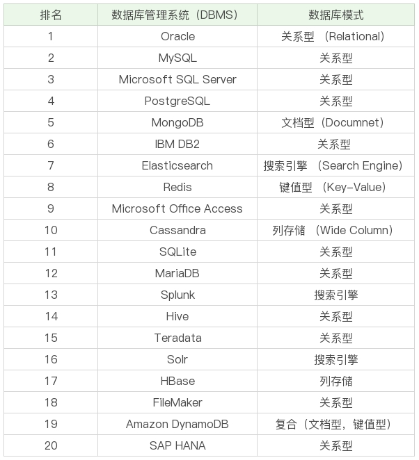
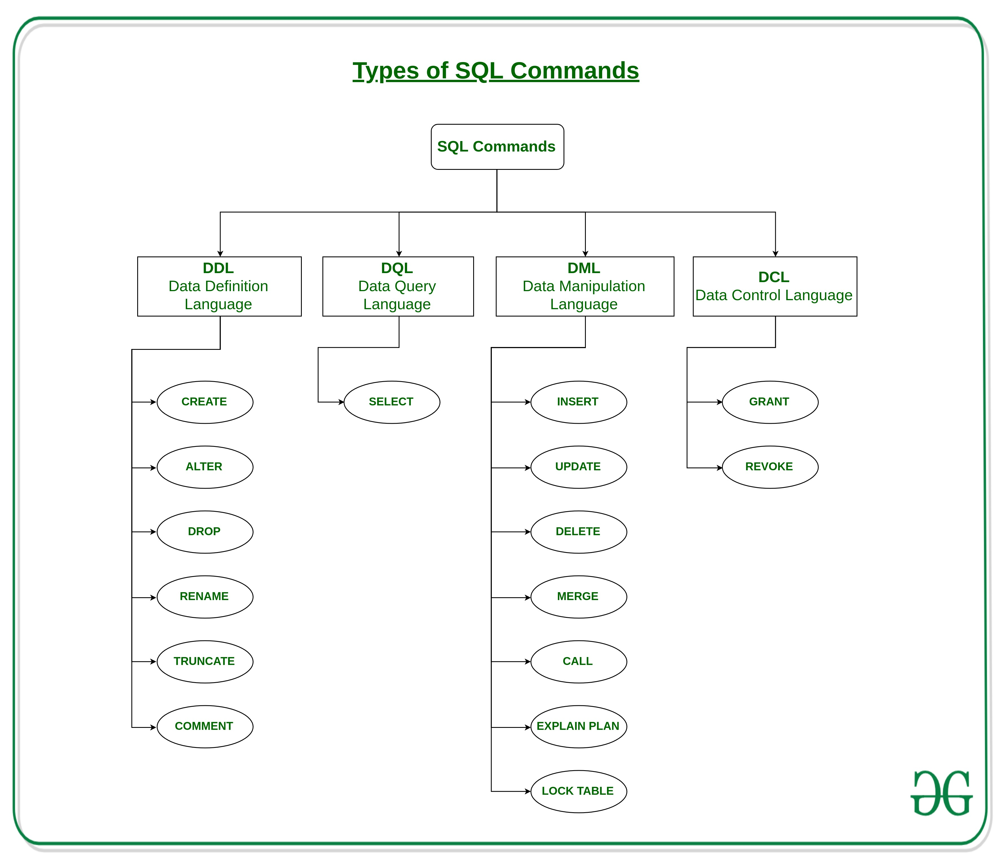
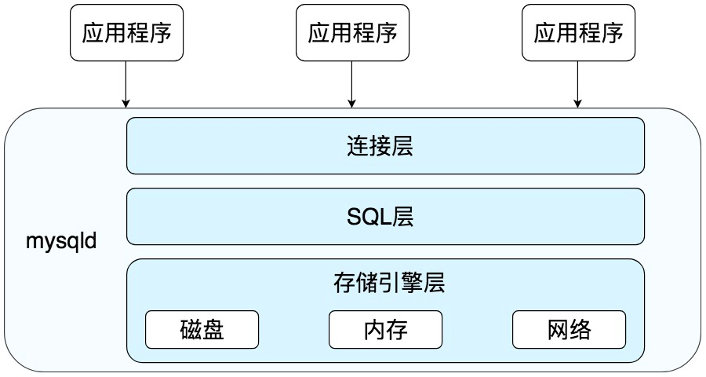

# SQL Overview

## SQL History

IBM 研究员在 1974 年发表了一篇有关结构化英语查询语言的论文，并将这门语言命名为 SEQUEL。SEQUEL 的语言标准是开放的，但是围绕它的商业化竞争却从来没有停止过。首先因为商标之争，SEQUEL 改名为 SQL，后来有一个重量级的公司基于那篇论文研发出了商业化的数据库管理软件，这就是 Oracle。自此之后，又诞生了一堆大家熟知的 DBMS，比如 MySQL、SQL Server、PostgreSQL、DB2 和 MongoDB 等。

---

## DB、DBS、DBMS

- DBMS 的英文全称是 DataBase Management System，数据库管理系统，实际上它可以对多个数据库进行管理，所以你可以理解为 DBMS = 多个数据库（DB） + 管理程序。
- DB 的英文是 DataBase，也就是数据库。数据库是存储数据的集合，你可以把它理解为多个数据表。
- DBS 的英文是 DataBase System，数据库系统。它是更大的概念，包括了数据库、数据库管理系统以及数据库管理人员 DBA。
- 这里需要注意的是，虽然我们有时候把 Oracle、MySQL 等称之为数据库，但确切讲，它们应该是数据库管理系统，即 DBMS。

---

## DBMS Ranking From DB-Engines

前 20 的 DBMS 都是那些



---

## Common Database Categories

- Relational，关系型数据库(SQL)
- DOcument，文档型数据库(NoSQL)
- Search engine，搜索型数据库(NoSQL)
- Key-Value，键值对型数据库(NoSQL)

> 键值型数据库通过 Key-Value 键值的方式来存储数据，其中 Key 和 Value 可以是简单的对象，也可以是复杂的对象。Key 作为唯一的标识符，优点是查找速度快，在这方面明显优于关系型数据库，同时缺点也很明显，它无法像关系型数据库一样自由使用条件过滤（比如 WHERE），如果你不知道去哪里找数据，就要遍历所有的键，这就会消耗大量的计算。键值型数据库典型的使用场景是作为内容缓存。Redis 是最流行的键值型数据库。

> 列式数据库是相对于行式存储的数据库，Oracle、MySQL、SQL Server 等数据库都是采用的行式存储（Row-based），而列式数据库是将数据按照列存储到数据库中，这样做的好处是可以大量降低系统的 I/O，适合于分布式文件系统，不足在于功能相对有限。

> 文档型数据库用来管理文档，在数据库中文档作为处理信息的基本单位，一个文档就相当于一条记录，MongoDB 是最流行的文档型数据库。

> 搜索引擎也是数据库检索中的重要应用，常见的全文搜索引擎有 Elasticsearch、Splunk 和 Solr。虽然关系型数据库采用了索引提升检索效率，但是针对全文索引效率却较低。搜索引擎的优势在于采用了全文搜索的技术，核心原理是“倒排索引”。

---

## Types of SQL commands

一般分成 5 类
1. DDL – Data Definition Language(数据定义语言，定义了数据库的结构和数据表的结构)
    - CREATE – is used to create the database or its objects (like table, index, function, views, store procedure and triggers).
    - DROP – is used to delete objects from the database.
    - ALTER-is used to alter the structure of the database.
    - TRUNCATE–is used to remove all records from a table, including all spaces allocated for the records are removed.
    - COMMENT –is used to add comments to the data dictionary.
    - RENAME –is used to rename an object existing in the database.
2. DQl – Data Query Language(数据查询语言)
    - SELECT – is used to retrieve data from the a database.
3. DML – Data Manipulation Language(数据处理语言)
    - INSERT – is used to insert data into a table.
    - UPDATE – is used to update existing data within a table.
    - DELETE – is used to delete records from a database table.
4. DCL – Data Control Language(数据控制语言)
    - GRANT-gives user’s access privileges to database.
    - REVOKE-withdraw user’s access privileges given by using the GRANT command
5. TCL(transaction Control Language)(事务控制语言)
    - COMMIT– commits a Transaction.
    - ROLLBACK– rollbacks a transaction in case of any error occurs.
    - SAVEPOINT–sets a savepoint within a transaction. 
    - SET TRANSACTION–specify characteristics for the transaction.



> 还有一些常用的比如视图、索引、存储过程、游标没有列出来

---

### DDL 

> 在 DDL 中，常用的功能是**增删改**，分别对应的命令是 CREATE、DROP 和 ALTER。需要注意的是，在执行 DDL 的时候，不需要 COMMIT，就可以完成执行任务。

定义数据库和数据表

0. 使用数据库和数据表

    ```sql
    show databases; // 显示所有的数据库
    use databases_name; // 使用某个数据库
    show tables; // 显示这个数据种所有的 tables
    ```

1. 定义数据库

    ```sql
    CREATE DATABASE nba; // 创建一个名为 nba 的数据库
    DROP DATABASE nba; // 删除一个名为 nba 的数据库
    ```

2. 定义数据表和创建表结构

    ```sql
    CREATE TABLE TableName (
        create_time datetime,
        plater_name varchar(25) not null
    )
    ```

    > 创建表结构一般不会在原生命令行进行操作，一般都是采用一些可视化工具进行创建；

3. 查询数据表结构

    查询表结构使用 desc TableName;
    查询表创建语句 show create table TableName

    ```sql
    mysql> desc player;
    +-------------+--------------+------+-----+---------+-------+
    | Field       | Type         | Null | Key | Default | Extra |
    +-------------+--------------+------+-----+---------+-------+
    | player_id   | int(11)      | NO   | PRI | NULL    |       |
    | team_id     | int(11)      | NO   |     | NULL    |       |
    | player_name | varchar(255) | NO   | UNI | NULL    |       |
    | height      | float(3,2)   | YES  |     | NULL    |       |
    +-------------+--------------+------+-----+---------+-------+
    4 rows in set

    SHOW CREATE TABLE students;// 查看创建表的 SQL 语句

    | player | CREATE TABLE `player` (
    `player_id` int(11) NOT NULL AUTO_INCREMENT COMMENT '球员ID',
    `team_id` int(11) NOT NULL COMMENT '球队ID',
    `player_name` varchar(255) NOT NULL COMMENT '球员姓名',
    `height` float(3,2) DEFAULT NULL COMMENT '球员身高',
    PRIMARY KEY (`player_id`) USING BTREE,
    UNIQUE KEY `player_name` (`player_name`) USING BTREE
    ) ENGINE=InnoDB AUTO_INCREMENT=10038 DEFAULT CHARSET=utf8 ROW_FORMAT=DYNAMIC |
    ```

4. 修改数据表结构

    **修改数据表名**
    `ALTER TABLE OldTableName RENAME TO NewTableName`

    ```sql
    alter table test_player rename player;  // Query OK, 0 rows affected
    ```

    **修改字段名(修改要带生数据类型)**
    `alter table TableName column old_column_name new_column_name data-type`

    ```sql
    alter table player change column age player_age int(11) not null;
    Query OK, 0 rows affected
    Records: 0  Duplicates: 0  Warnings: 0
    ```

    **修改字段数据类型(修改要带生数据类型)**
    `alter table TableName modify column column_name data-type`

    ```sql
    mysql> alter table player modify column player_age int(20) comment '玩家年龄';
    Query OK, 0 rows affected
    Records: 0  Duplicates: 0  Warnings: 0
    ```

    **增加字段**
    `alter table TableName add column column_name data-type`

    ```sql
    alter table player add column city varchar(20) comment '玩家所在城市';
    Query OK, 0 rows affected
    Records: 0  Duplicates: 0  Warnings: 0

    ```

    **删除字段**
    `alter table TableName drop column column_name`

    ```sql
    alter table player drop column city;
    Query OK, 0 rows affected
    Records: 0  Duplicates: 0  Warnings: 0
    ```

### DML

1. INSERT – is used to insert data into a table.

    `INSERT INTO TableName (column_name1, column_name2, ...) VALUES (value1, value2, ...);`

    ```sql
    > insert player
    -> (team_id, player_name, height)
    -> value
    -> (10001, '詹姆斯', 2.03);
    Query OK, 1 row affected (0.006 sec)
    ```

    插入多个数据
    ```sql

    > insert player
    -> (team_id, player_name, height)
    -> value -- 可以是 `values`，也可以不加 `s`
    -> (10001, '戴维斯', 2.13), -- 注意要加 `,`，不然语法会报错
    -> (10001, 'jr 史密斯', 1.98)
    -> ;
    Query OK, 2 rows affected (0.004 sec)
    Records: 2  Duplicates: 0  Warnings: 0
    ```
    > 一般自增的键不需要填写，column 和 value 对应就可以了


2. UPDATE – is used to update existing data within a table.
    `UPDATE TableName SET column1=value1, column2=value2, ... WHERE ...;`
    
    更新一条数据，根据过滤条件进行筛选，这个时候一般使用唯一的 column 进行过滤，不然会影响其他数据，当然也可以使用多重过滤：

    ```sql
    update player
    -> set
    -> height=1.98
    -> where player_name = 'James'
    -> ;
    Query OK, 1 row affected (0.005 sec)
    Rows matched: 1  Changed: 1  Warnings: 0
    ```
    

    更新多条数据，只要将过滤条件过滤出多条数据就可以了

    ```sql
    > update player
    -> set
    -> height=2.03
    -> where team_id = 1001
    -> ;
    Query OK, 2 rows affected (0.006 sec)
    Rows matched: 2  Changed: 2  Warnings: 0
    ```

    更新数据的时候，也可以使用运算符，比如将本班的成绩 +10，但是这个操作其实和更新多条数据还是有区别的，能控制的更加细，而不是全部设置为一个 number；

    ```sql
    > update player
    -> set
    -> height=height+5
    -> where team_id = 1001
    -> ;
    Query OK, 2 rows affected (0.005 sec)
    Rows matched: 2  Changed: 2  Warnings: 0
    ```

3. DELETE – is used to delete records from a database table.
    
    `DELETE FROM TableName WHERE ...;`

    删除一条数据，就是根据过滤条件进行筛选，比如删除 player_name = '詹姆斯' 的数据
    ```sql
    > delete from
    -> player
    -> where player_name = '詹姆斯'
    -> ;
    Query OK, 1 row affected (0.006 sec)
    ```
    > 当过滤数据没有符合条件的，默认不会删除任何数据

    删除多条，也是根据过滤条件进行筛选，符合条件的就会删除，比如 删除 team_id = 10001 的数据

    ```sql
    > delete from
    -> player
    -> where team_id = 10001
    -> ;
    Query OK, 2 rows affected (0.004 sec)
    ```
    > 如果没有过滤条件：`DELETE FROM students;`，并且没有关联，会删除整个表的数据，但是表还是存在的；如果关联了外键，且创建外键时定义了ON DELETE CASCADE：关联数据被自动删除；


## 数据表约束

### 主键和外键约束

主键：起的作用是唯一标识一条记录，不能重复，不能为空，即 UNIQUE+NOT NULL。一个数据表的主键只能有一个。主键可以是一个字段，也可以由多个字段复合组成。

外键：确保了表与表之间引用的完整性。一个表中的外键对应另一张表的主键。外键可以是重复的，也可以为空。

### 字段约束

- NOT NULL：字段是否有值，not null 就是必须有值；
- DEFAULT：字段默认值，null/default value/empty string 有这三种默认值，其中 default value 就是每次不传入值的时候默认是，比如性别，不传入的时候默认是男，类似的这种应用；
- 唯一约束性：不仅主键是唯一值，而其他字段也可以是唯一值 unique ，比如某个字段是身份证信息，这个信息就具有唯一性，哪怕不是主键，也要设置成唯一性，这样才能保证程序的正确；
- CHECK：约束，用来检查特定字段取值范围的有效性，CHECK 约束的结果不能为 FALSE，比如我们可以对身高 age 的数值进行 CHECK 约束，必须≥0，且＜3，即CHECK(age>=0 AND age<200)；

## 设计数据表的原则

1. 数据表的个数越少越好
2. 数据表中的字段个数越少越好
3. 数据表中联合主键的字段个数越少越好
4. 使用主键和外键越多越好，这个有争议，外键使用会保证程序的正确性，但是会丢失性能，所以这个外键使用要有取舍，一般根据项目使用，有一些项目会限制外键的使用，将外键放到业务逻辑中处理，具体还是看实际的项目；

## 使用 Navicat

可视化创建完成后，可以导出结构或者数据，方法是在 Navicat 左侧用右键选中 player 这张表，然后选择“转储 SQL 文件”→“仅结构”，这样就可以看到导出的 SQL 文件了，代码如下：

```sql
/*
Navicat MySQL Data Transfer

Source Server         : localhost_3306
Source Server Version : 50505
Source Host           : localhost:3306
Source Database       : sql_test

Target Server Type    : MYSQL
Target Server Version : 50505
File Encoding         : 65001

Date: 2020-09-22 14:40:25
*/

SET FOREIGN_KEY_CHECKS=0;

-- ----------------------------
-- Table structure for player
-- ----------------------------
DROP TABLE IF EXISTS `player`;
CREATE TABLE `player`  (
  `player_id` int(11) NOT NULL AUTO_INCREMENT,
  `team_id` int(11) NOT NULL,
  `player_name` varchar(255) CHARACTER SET utf8 COLLATE utf8_general_ci NOT NULL,
  `height` float(3, 2) NULL DEFAULT 0.00,
  PRIMARY KEY (`player_id`) USING BTREE,
  UNIQUE INDEX `player_name`(`player_name`) USING BTREE
) ENGINE = InnoDB CHARACTER SET = utf8 COLLATE = utf8_general_ci ROW_FORMAT = Dynamic;
```

player_name 字段的字符集是 utf8，排序规则是utf8_general_ci，代表对大小写不敏感，如果设置为utf8_bin，代表对大小写敏感；

整个数据表的存储规则采用 InnoDB。之前我们简单介绍过 InnoDB，它是 MySQL5.5 版本之后默认的存储引擎。同时，我们将字符集设置为 utf8，排序规则为utf8_general_ci，行格式为Dynamic，就可以定义数据表的最后约定了：

```sql
ENGINE = InnoDB CHARACTER SET = utf8 COLLATE = utf8_general_ci ROW_FORMAT = Dynamic;
```

## MySQL 中的 SQL 是如何执行的

MySQL 是典型的 C/S 架构，即 Client/Server，服务端使用的程序是 mysqld，整体的大概流程如下：



MySQL 有三部分组成：

1. 连接层，C 和 S 建立连接，C 发送 SQL 到 S；
2. SQL 层，对 SQL 语句进行查询处理；
3. 存储引擎层，与数据库文件进行交互，负责数据的存储、读取、删除等操作；

### 连接层结构

### SQL 层结构


> 在 MySQL8.0 之后已经抛弃了查询缓存的功能，所以只要关注解析器、优化器、执行器就可以了，抛弃的原因是：数据表有更新后，缓存都会被清空，也就是只有在表是静态的时候/很少变化，缓存才会起作用，如果数据表经常更新，反而会增加 SQL 的查询时间

1. 解析器：对 SQL 语句进行语法、语义解析，就相当于编程语言的解释器或者编译的过程，确保 SQL 语句是符合规定的；
2. 优化器：SQL 的优化，是否全局索引还是根据索引进行索引，这层主要是查询是否其他已经预设的规则，没有则会按照默认执行；
3. 执行器：进行一些判断，比如用户权限判断，如果符合这些规则，那么会 进行 SQL 操作，并返回结果给 Client 端；整个操作过程结束；

### 存储引擎层节后

MySQL 存储引擎是采用插件的形式，更加开发，开发者可以选择适合业务的存储引擎进行开发；

常见的所有引擎：

1. InnoDB 存储引擎：它是 MySQL 5.5 版本之后默认的存储引擎，最大的特点是支持事务、行级锁定、外键约束等。
2. MyISAM 存储引擎：在 MySQL 5.5 版本之前是默认的存储引擎，不支持事务，也不支持外键，最大的特点是速度快，占用资源少。
3. Memory 存储引擎：使用系统内存作为存储介质，以便得到更快的响应速度。不过如果 mysqld 进程崩溃，则会导致所有的数据丢失，因此我们只有当数据是临时的情况下才使用 Memory 存储引擎。
4. NDB 存储引擎：也叫做 NDB Cluster 存储引擎，主要用于 MySQL Cluster 分布式集群环境，类似于 Oracle 的 RAC 集群。
5. Archive 存储引擎：它有很好的压缩机制，用于文件归档，在请求写入时会进行压缩，所以也经常用来做仓库。

> 数据库的设计在于表的设计，MySQL 种的每个表设计都可以采用不同的存储引擎，这个是 MySQL 非常强大的地方


## MySQL 执行使用时间

1. profiling 开启，这个模块收集 MySQL 执行 SQL 花费的资源(时间)，

```bash
mysql> select @@profiling; # 是否开启 mysql profiling
+-------------+
| @@profiling |
+-------------+
|           0 |
+-------------+
1 row in set

mysql> set profiling=1; # 设置开启
Query OK, 0 rows affected

mysql> show profiles; # 查询最近的查询记录 Query_ID 代表查询的 ID 号，一般也会用这个来分析具体某个查询的资源消耗；
+----------+-----------+---------------------------+
| Query_ID | Duration  | Query                     |
+----------+-----------+---------------------------+
|        1 | 0.0007561 | select @@profiling        |
|        2 | 0.0005826 | select * from fisher.user |
|        3 | 0.0006736 | select * from fisher.user |
|        4 | 0.0001639 | show profiling            |
+----------+-----------+---------------------------+
4 rows in set

mysql> show profile for query 2 # 查询某个具体的操作资源消耗明细
;
+------------------------+----------+
| Status                 | Duration |
+------------------------+----------+
| Starting               | 8.4E-5   |  # 开始查询
| Checking permissions   | 1.7E-5   |  # 权限检查
| Opening tables         | 3.6E-5   |  # 打开 table
| After opening tables   | 1.9E-5   |  # 上下文操作
| System lock            | 1.1E-5   |  # 数据库加锁
| Table lock             | 1.5E-5   |  # table 加锁
| Init                   | 4.2E-5   |  # 初始化
| Optimizing             | 1.8E-5   |  # 优化查询
| Statistics             | 2.8E-5   |
| Preparing              | 2.6E-5   |  # 准备
| Executing              | 1E-5     |  # 执行
| Sending data           | 9.4E-5   |  # 发生数据
| End of update loop     | 1.4E-5   |  # 终止更新循环
| Query end              | 9E-6     |  # 查询结束
| Commit                 | 1.6E-5   |  # 提交
| Closing tables         | 9E-6     |  # 关闭 tables
| Unlocking tables       | 8E-6     |  # tables 解锁
| Closing tables         | 1.4E-5   |  # 关闭 tables（其他关联的表）
| Starting cleanup       | 9E-6     |  # 开始清理
| Freeing items          | 1.3E-5   |
| Updating status        | 8.1E-5   |
| Reset for next command | 1.2E-5   |
+------------------------+----------+
22 rows in set
```

---

## English

distinct：不同
profiles: 解析
query：查询
Duration：响应时间
duration of response for Flask：flask的响应时间
execute/executing：执行
describe/description：描述

Ascending：上升，升序
Descending：下降，降序
