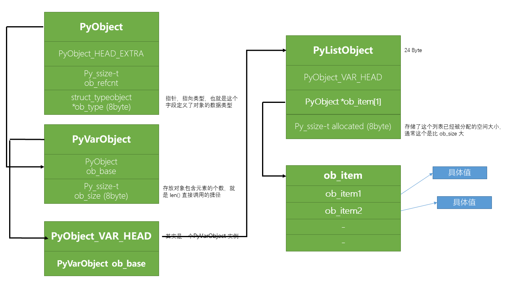

# CPython

[Python官方文档：列表是如何在CPython中实现的？](https://docs.python.org/zh-cn/3/faq/design.html#how-are-lists-implemented-in-cpython)
[文章：list 在 CPython 中实现](https://github.com/zpoint/CPython-Internals/blob/master/BasicObject/list/list_cn.md)

> CPython的列表实际上是可变长度的数组，是一个 over-allocate（过度加载） 的 array，而不是lisp风格的链表。该实现使用对其他对象的引用的连续数组，并在列表头结构中保留指向该数组和数组长度的指针。
> 这使得索引列表 `a[i]` 的操作成本与列表的大小或索引的值无关。
> 当添加或插入项时，将调整引用数组的大小。并采用了一些巧妙的方法来提高重复添加项的性能; 当数组必须增长时，会分配一些额外的空间，以便在接下来的几次中不需要实际调整大小。

---

## Cpython 中 list 结构



list 初始大小是 40 byte：

- 一个变长对象的大小至少占24个字节
  - ob_size（8 byte）：Py_ssize_t 类型，存储当前 list 有意义的元素个数（也就是 len() 函数直接操作了这个值得到的，所以复杂度是 O(1) ）；
- 结构体成员
  - `**ob_item`（8 byte）：是一个二级指针，指向具体的 Array，这个 Array 是存放内存地址的，不是具体的对象，ob_item 是指向 Array 第一个 element 内存地址，大小为 8 Byte；
  - allocated（8 byte）：存储这个列表已经被分配的空间大小，这个一般比具体的内存大（len(li)），ob_size 是 len() 值，大小为 8 Byte；
  - Array：空列表是 0 byte，一个元素是 8 Byte，这个元素其实也是一个指针，64 位机器一个指针 8 Byte；

所以初始化空 list 大小是 40 Byte，同理一个初始化元素 list 大小是 48 Byte，因为有一个  element；初始化的时候 list 都是固定大小的，但是一旦发生改变，上一次分配的内存满了/少了很多，比如扩容和删减，有相应高效的算法进行动态的内存大小管理；

---

## 扩容 allocated 分配的核心算法

有一套高效的算法，不是每次都会增加 4 的；

核心代码

```c
/* cpython/Objects/listobject.c */
/* 空间增长的规律是:  0, 4, 8, 16, 25, 35, 46, 58, 72, 88, ... */
/* 当前的: new_allocated = 5 + (5 >> 3) + 3 = 8 */
new_allocated = (size_t)newsize + (newsize >> 3) + (newsize < 9 ? 3 : 6);
```

---

## 删减 realloc 函数算法

只有在新申请的内存空间比现有的内存空间大一倍时候，才会进行删减操作，也就是现有的只占用申请空间的 1/2 一下时候才会释放

核心代码

```c
/* cpython/Objects/listobject.c */
/* allocated: 8, newsize: 3, 8 >= 3 && (3 >= 4?), 已经比一半还小了 */
if (allocated >= newsize && newsize >= (allocated >> 1)) {
    /* 如果当前空间没有比原空间一半还小 */
    assert(self->ob_item != NULL || newsize == 0);
    /* 只更改 ob_size 这个字段里的值即可 */
    Py_SIZE(self) = newsize;
    return 0;
}
/* ... */
/* 3 + (3 >> 3) + 3 = 6 */
new_allocated = (size_t)newsize + (newsize >> 3) + (newsize < 9 ? 3 : 6);
```

---

## free_list

解释器进程，会有一个全局变量 free_list ，这个涉及到内存管理机制，解释器会将删除的 list 进行缓存，下次再创建相同的 list 会直接从缓存中取，如果没有才会再内存中重新申请；

把空闲的 list 对象缓存到 free_list 中有如下好处

1. 提高性能
2. 减小内存碎片