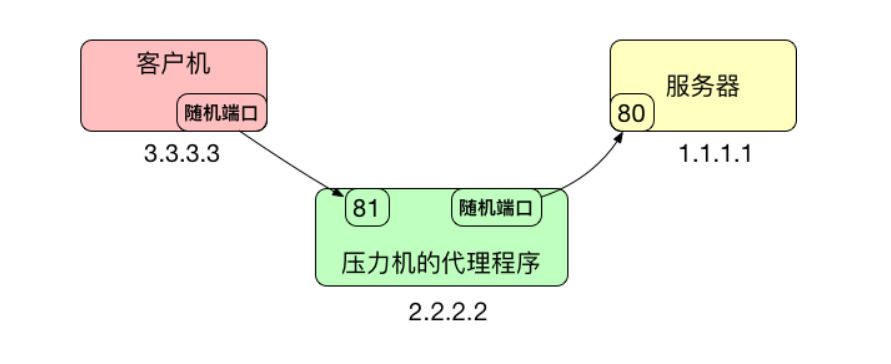

# JMeter 基础使用

## 关于性能测试

简单理解：对于性能指标的测试就是性能测试
功能测试：关注能不能用
性能测试：关注好不好用
性能测试开始点：功能测试基本完成之后
性能测试关注点：

- 接口响应时间
- 吞吐量
- TPS：事务处理能力，每秒处理事务数量

压力类型：

短时大并发：验证最大处理能力
长时小并发：验证长时间运行的稳定性

影响系统性能的因素：代码性能、系统架构、网络架构、存储读写性能、硬件性能

性能测试价值：预测系统的性能瓶颈点、星恒成本和收益

## JMeter 安装和配置

官网：
下载安装包：
开始服务：

JMeter 功能模块

主要功能模块

- 取样器：进行脚本的逻辑控制
- 线程组：压测场景控制
- 监视器：监控压测运行，获取性能指标

## 性能测试脚本编写

脚本的编写一般分成两类：录制、手工编写

### JMeter 录制

JMter 脚本录制是使用代理录制的：通过代理服务器设置，转发客户端和服务端的交互协议，生成脚本文件；



代理是用来转发数据包的，而不是重定向的，同时客户机和压力机（代理服务器）也不需要在同一台计算机上；

> 代理工具就是用来转发的，而不是其他功能，比如网络代理进行科学上网，也是用的转发来实现的，而不是其他的意思；


添加一个 HTTP(S) Test Script recorder

```shell
Test Plan
    Thread Group
        Recording Controller
    HTTP(s) Test Script Recorder
```

group 选项一共是 5 个，需要学习一下

- do not group sample：不分组
- add separators between groups：组间添加间隔，为了好区分和好看
- put each group in a new controller：每个组放一个新的控制器，这是一个 simple contrpller，她的作用只有一个为了好看和观看的时候更加清晰
- put each group in a new transaction controller：将每个组放入到一个新的事务控制器里面
- store 1st sampler for each group only：每组支取第一个样本

录制的时候需要使用正则匹配，将不需要的文件进行排除，避免录制过多没必要的请求；

一般静态资源都是走 cdn 加速的功能，很少有不走的，但是如果不走 cdn 的话，这个还是需要加载这些资源的，就是不能正则忽略这些静态文件，如果测试环境中没有 cdn，这个就可以忽略，但是如果生产环境也没有，测试环境也就要进行加载；

配置浏览器的代理服务器地址：指向本地 jmeter 端口号

进行脚本录制，录制完成后需要再验证一下录制是否正确

- 添加 View Result Tree
- 开始请求，验证是否正确

#### 完成一个实战录制请求

录制回放的主要流程：

- JMeter 脚本录制钱要梳理一下业务步骤和流程、并明确测试步骤；
- 创建代理的录制器
- 添加线程组、添加录制控制
- 配置代理的选项：端口、正则过滤响应的文件
- 配置浏览器的代理
- 开启 JMeter
- 进行录制
- 完成录制
- 验证录制的正确性
- 添加响应断言
- 完成脚本的录制

### 响应断言

平时在做压测的时候，要保证压测的动作是真的压上了还是没有压上，这个时候据一定要加断言，不然不加断言，发生错误了，你根本就没有真正的压上了，一定要加断言；

断言一般会判断以下内容

http 响应码
response 内容，比如标题，和response 某个内容

### 添加聚合压测报告

压测报告：展示常用的一套压测结果的报告
展示请求与响应性能参数
累计值压测数据值的展示
建议连续压测，如果中间有间断就需要数据清理，不然压测报告会是一个累计的值，而不是真实的值

添加一个 Aggregate Report 即可，以下是对应的参数

Average：单个请求的平均响应时间
Median：中位数，也就是 50% 用户的响应时间
90% Line：90% 用户的响应时间
99% Line：99% 用户的响应时间
Min：最小请求响应时间
Max：最大请求响应时间
Error：错误率
Throughput：吞吐量，每秒能完成多少个请求
Received KB/sec：每秒服务器收到的数据量
Sent KB/sec：每秒从客户端发送的请求的数量

平均值的困扰：个别的极端结果对实际性能数据产生了干扰，N% Line 更加能体现客观的实际性能；

### JMeter 命令行压测

脱离 UI 运行 JMeter 压测，更加性能高、自动化、可控制和定制化
命令形式：jmeter -n -t $jmx_file -l $jtl_file

## JMeter 接口压力测试

Restful API

- 基于 http/https
- url 资源定位符
- 常见的 method：GET|POST|PUT|DELETE
- 常见的执行状态返回码
  - 200：成功
  - 302：重定向
  - 404：资源不存在
  - 500：服务器内部错误

设置 http header manager：设置header 参数，包括 token、content-type、cookie等请求参数；
http header manager 可以设置为全局的，这样子就不用在每个请求里都写上了

JMeter unicode 码如何解决，默认不会显式中文，需要设置成 utf-8

## JMeter 中的数据传递问题

在 Sample 中添加 Debug Sample
JMeter Properties：JMeter 属性
JMeter Variables：JMeter 变量
System Properties：系统属性

一般使用 JMeter Variables 就可以了其他基本不使用

Debug Sampler 一般放到最后边，

### cookie 和 token 数据传递

参数的传递一般采取 JMeter 变量的形式进行保存，会在登录之后，add 一个 Post Processors的 JSON Extractor 进行解析；

解析方法：使用 JSON 的路径表达式进行匹配拿到变量值，`$.` 表示 JSON 的根节点，可以在 View Result Tree 中打开 JSOn Path Tester 来确定匹配路径的正确性；

JSON Path Tester 可以进行验证，也就是 JSON Path Expression 中进行测试验证一下变量的名字提取结果，然后填入到 JSON Extractor，0 是随机的，一般会写一个 1，取决于你的 JSON 返回值，如果要是结果很深，还要再解析，形式类似 $.token2.token3 ；

解析到 token 值后，会保存到下一次请求之前的 http header manger 中，保存的方式是 `${token}`，注意不要保存成最外边的全局，因为会影响第一次；

如果碰到每个接口都需要请求的，那就要每个都要进行处理，这种情况很少，一般一系列操作的生命周期中只需要一个 token；

## 全局参数设置和 CSV 数据导入

一般 hostname、ip、port、protocol（协议）等都可以设定为全局变量；

全局参数在 Config-Element--> User Defined Variables 中进行设置，设置完成后会使用 ${Variable name} 进行使用和调用；

CSV 数据导入：
场景：比如登录 100 个用户，那就需要 100 个用户的账号和密码，还比如配置文件，一般都会使用CSV 这种格式的数据进行导入；

CSV 数据在 Config-Element--> User Defined Variables，
设置的话，一般使用默认就可以了，
Variable name：数据参数，要加`,` 间隔
Allow quoted data 是否允许双括号括住数据
Recycle on EOF：到数据文件结尾是否循环，比如 10个用户数据，可能 2 秒就使用完了，起不到压测的效果了；
Stop thread on EOF：到文件结尾是否停止循环，到文件结尾是否停止

CSV 文件引用也是使用 `${csv variable name}`

有时候因为 session 原因，用户数据比较少，这个时候会存在账户互踢的状况；

## ramp-up 和调度器

ramp-up：

调度器：

## 压测计划

制定压测计划：不同的并发数：10、50、100、200、400
记录结果
测试期望结果：

- 正式压测一定是要用命令行的压测
- 验证能偶支撑多大并发数、巅峰值
- 验证错误率，定义可接受范围：>= 0.5%， >= 1%，>= 1%，>= 2%
- 寻找系统性能点，一般资源会到一个顶峰值的状态，这个时候要找出系统的瓶颈点；
- 测试机和被测机应该在一个机房，而不是简单的使用 Wifi，要保证测试环境的稳定性；
- JMeter 对错误的流量也会统计到响应的总流量中，但是这个错误的流量是没有意义的
- 错误率高的的时候，90% 类似这些指标是不准确的，因为很多响应是错误的
- 模拟 100 万个用户，肯定不能用实际的用户去压测，这个时候可以写一个程序，使用程序生成一个 100 万用户数据，存到数据库中；
- 模拟 100 万个用户登录时候，没有这些数据，可以使用 mook 的方式，比如互踢的时候不踢线，这个可以做成一个开关；
- 压测时间的长度会做出评估，要根据业务，常见的短时间的大并发时间都不会很长，比如订餐时间可能饭点会流量大，所以会压一个小时，抢票的可能就会压 10 min、30 min 大并发压力；

### 测试报告解读

### 实施计划

通过对比并发数和流量和错误率的关系，找到一个合理的系统可支撑最大并发数
可以先把并发数往大增加、压出问题之后，再逐步减少
找到系统可以支持的最合理最大并发数

### 为啥要进行压力测试

- 手动逐步加压
- 需要人肉该并发数，然后等待完成
- 过程繁琐，烦！！！！！

解决方法：
制定好策略，让程序自动加压，自动等待、自动生成报告
让精力更好的用在更加重要的时候

### 自动化压测

- 测试逻辑：放到 JMeter 脚本
- 控制逻辑，放到 Shell 脚本上
- 并发数修改，使用 Linux 三剑客（），再 Thread Group 进行字符串替换
- JMeter 静默运行：jmeter -n -t $jmx_file -l $jtl_file

#### 自动化压测基本流程

1. 生成对应并发数的 jmx 文件
2. JMeter 命令行压测
3. 完成相应的并发数
4. 是否完成所有并发数

## 课程总结

1. 性能测试概念、关注点
2. JMeter 简介
3. 录制回放学习
4. 常见接口压测请求
5. 解析响应 JSON 数据包中的数据
6. 数据在接口之间的传递
7. 全局变量和 CSV 数据导入
8. 实战运行压测策略
9. 压力测试的自动化执行，shell 脚本形式

## 英语学习

domains：域，也就是 ip 地址
ramp-up period：加速器，也就是多少时间内达到 users 数量
infinite：无限的


压力换算关系：80% 流量是发生在 20% 时间内，计算一下现在系统所能承担的压力；

接口测试：接口错误/接口没有

有些接口勾选了keep alive会影响后面的接口，导致请求不能发出（jmeter默认勾选）
